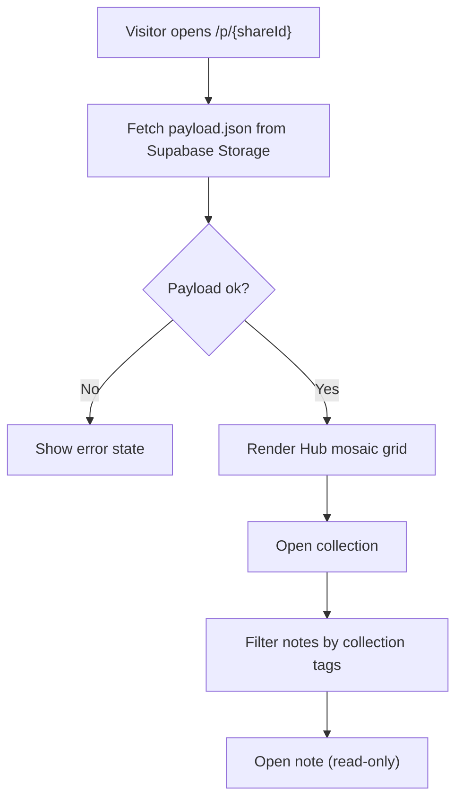

## 1. Product Overview
Konuq Web is a read-only web viewer for a published Konuq Hub.
It renders the Hub grid and opens notes in a web UI that matches the in-app experience.

- Purpose: let a logged-in Konuq user publish a Hub to a public, read-only website.
- Value: share a Hub as a link (stable link), with a future path to custom domains.

## 2. Core Features

### 2.1 User Roles
| Role | Registration Method | Core Permissions |
|------|---------------------|------------------|
| Visitor | None | Open a published Hub link, browse Hub grid, open notes (read-only) |

### 2.2 Feature Module
1. **Published Hub page**: load payload by shareId, render mosaic grid, open a collection view.
2. **Note page**: render a note (blocks, headings, images) in read-only mode.
3. **Error states**: not found, payload invalid, partial media missing.

### 2.3 Page Details
| Page Name | Module Name | Feature description |
|-----------|-------------|---------------------|
| Published Hub | Data loader | Fetch payload.json from Supabase Storage using shareId |
| Published Hub | Mosaic grid | Deterministic placement with spans; responsive column count |
| Published Hub | Collection view | Filter notes by collection tags; show note cards; open note |
| Note | Block renderer | Render markdown-ish blocks (text + headings) and images |
| Note | Media handling | Images via mediaIndex; videos show “not available on web” |
| Errors | Fallback UI | Friendly errors for missing shareId/payload/media |

## 3. Core Process
User flow:
- Visitor opens a link `/p/{shareId}`.
- Web app downloads `/published_hubs/{shareId}/payload.json`.
- UI renders Hub grid.
- Visitor taps a tile to open the collection and list its notes.
- Visitor opens a note; the page renders blocks and images.

## 4. User Interface Design

### 4.1 Design Style
- Direction: editorial + calm, “app-like” UI with clear typography and generous spacing.
- Colors: light theme default with subtle neutrals; accent color for focused actions.
- Typography: strong titles for tiles/notes; readable body with good line-height.
- Layout: desktop-first; centered max width; grid is responsive with discrete column counts.
- Motion: subtle fade/slide on load; hover states for tiles/cards.

### 4.2 Page Design Overview
| Page Name | Module Name | UI Elements |
|-----------|-------------|-------------|
| Published Hub | Header | Hub title, minimal meta, subtle background |
| Published Hub | Grid tiles | Tile with emoji/title/tags + optional background image |
| Published Hub | Collection sheet/page | Title, tag list, note cards |
| Note | Reader | Block-based layout, headings, inline images, spacing presets |
| Errors | Empty state | Helpful message + retry |

### 4.3 Responsiveness
- Desktop-first, then scale down to tablet/mobile.
- Grid column count derived from container width (clamped min/max).
- Notes reader uses a comfortable max-width for readability.
