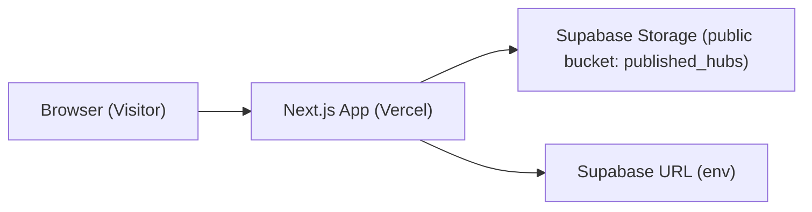

## 1. Architecture Design

## 2. Technology Description
- Frontend: Next.js (React) + TypeScript
- Styling: Tailwind CSS
- Hosting: Vercel
- Data source: Supabase Storage public objects
- No backend required for V1

## 3. Route Definitions
| Route | Purpose |
|-------|---------|
| /p/[shareId] | Published Hub viewer page (grid + collections + notes) |

## 4. Data Contract

### 4.1 Environment Variables
- `NEXT_PUBLIC_SUPABASE_URL`: Supabase project URL (e.g. https://xxxx.supabase.co)

### 4.2 Supabase Storage Paths
- Payload: `published_hubs/{shareId}/payload.json`
- Media: `published_hubs/{shareId}/media/{sha256}.jpg`

### 4.3 Payload Schema (PublishHubPayloadV1)
- `schemaVersion: number` (1)
- `publishedAtMs: number`
- `shareId: string`
- `hub: { id, title, position, createdAt, updatedAt }`
- `collections: HubCollection[]` (includes `position`, `spanColumns`, `spanRows`, background fields, tags)
- `notes: NoteSnapshotV2Item[]` (read-only blocks + tags)
- `mediaIndex: Record<string, string>`
  - key: original app media reference (e.g. `media:abc.heic`)
  - value: relative published path (e.g. `media/0123abcd.jpg`)

## 5. Rendering Strategy
- Mosaic placement: deterministic JS implementation of “first-fit” placement using `spanColumns/spanRows` and computed column count.
- Collections: derive notes by tag subset rule (collection tags ⊆ note tags).
- Media:
  - For images: resolve via `mediaIndex[mediaReference]`, build public URL from `NEXT_PUBLIC_SUPABASE_URL`.
  - For videos: show a placeholder (“Video not available on web”).

## 6. Project Structure (Proposed)
- `app/p/[shareId]/page.tsx`: route entry, fetch payload
- `src/lib/supabasePublic.ts`: build public storage URLs
- `src/lib/mosaic.ts`: placement algorithm
- `src/components/HubGrid.tsx`: grid rendering
- `src/components/HubTile.tsx`: tile UI
- `src/components/CollectionView.tsx`: collection notes list
- `src/components/NoteView.tsx`: note renderer
